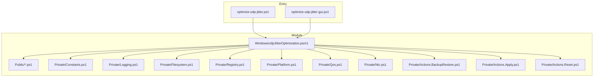

# Windows UDP Jitter Optimization - Technical Documentation

Comprehensive technical reference for the module, CLI wrapper, and GUI.

## Contents

- Overview
- Architecture
- Public interfaces and parameters
- Action flows
- Backup and restore model
- Known Limitations
- Fix History (condensed)
- Operational Troubleshooting
- Development and validation

## Overview

The project optimizes UDP latency variance on Windows by combining:

- QoS DSCP marking (`EF=46`) on selected ports/apps
- Local QoS registry enablement (`Do not use NLA`)
- Preset-based NIC and networking tuning
- Full backup and restore support before/after changes

Primary entrypoints:

- CLI wrapper: `optimize-udp-jitter.ps1`
- GUI: `optimize-udp-jitter-gui.ps1`
- Module function: `Invoke-UdpJitterOptimization`

## Architecture



Module load order is deterministic:

1. `Constants.ps1`
2. Ordered private scripts (`Logging`, `Filesystem`, `Registry`, `Platform`, `Qos`, `Nic`, `Actions.*`)
3. Ordered public scripts (`Get-UjDefaultBackupFolder`, `Invoke-UdpJitterOptimization`)

## Public Interfaces and Parameters

### Exported functions

- `Invoke-UdpJitterOptimization`
- `Get-UjDefaultBackupFolder`
- `Test-UjIsAdministrator`

### Core parameters (`Invoke-UdpJitterOptimization`)

- `-Action`: `Apply | Backup | Restore | ResetDefaults`
- `-Preset`: `1 | 2 | 3` (Apply only)
- `-TeamSpeakPort`, `-CS2PortStart`, `-CS2PortEnd`
- `-IncludeAppPolicies`, `-AppPaths`
- `-AfdThreshold`
- `-PowerPlan`: `None | HighPerformance | Ultimate`
- `-DisableGameDvr`, `-DisableUro`
- `-BackupFolder`
- `-AllowUnsafeBackupFolder`
- `-DryRun`
- `-PassThru`
- `-SkipAdminCheck`

### `-PassThru` result schema

Returned object:

- `Action` (string)
- `Preset` (int or null)
- `DryRun` (bool)
- `Success` (bool)
- `BackupFolder` (string or null)
- `Timestamp` (datetime)
- `Components` (ordered hashtable, component -> `OK|Warn|Skipped`)
- `Warnings` (string[])

## Action Flows

### Apply

1. Validate input and admin context (unless `-SkipAdminCheck`)
2. Validate backup path safety (unless `-AllowUnsafeBackupFolder`)
3. Backup state
4. Apply MMCSS/audio/QoS/NIC/AFD/MMCSS-network/URO/power/GameDVR changes
5. Print summary

### Backup

1. Validate backup path safety
2. Export registry/QoS/NIC/RSC/power state
3. Write `backup_manifest.json`

### Restore

Restore components are handled independently with explicit status mapping:

- `Registry`
- `Qos`
- `NicAdvanced`
- `Rsc`
- `PowerPlan`

Each component reports `OK`, `Warn`, or `Skipped`. Restore prints a one-line component summary.

### ResetDefaults

Restores baseline behavior for power, registry/network tweaks, managed QoS, and selected NIC properties.

## Backup and Restore Model

Default backup folder resolves through module constants (`ProgramData\UDPTune` on Windows; safe fallback on non-Windows environments).

Backup artifacts:

- `SystemProfile.reg`
- `AFD_Parameters.reg`
- `qos_ours.xml`
- `nic_advanced_backup.csv`
- `rsc_backup.csv`
- `powerplan.txt`
- `backup_manifest.json`

Managed QoS scope:

- Policies with name prefix `QoS_` are considered managed.

## Known Limitations

- DSCP benefits depend on end-to-end network policy honoring DSCP values.
- NIC advanced settings vary by driver and hardware; unsupported properties are skipped.
- Some netsh or adapter operations may be unavailable on specific Windows builds/drivers and can degrade to warnings.
- Restore is best-effort per component; partial warning states are possible and surfaced in the component summary.

## Fix History (condensed)

Recent stabilization work included:

- Full `ShouldProcess` coverage for restore/reset-sensitive operations.
- Corrected GameDVR writes to `New-ItemProperty -PropertyType DWord`.
- Locale-independent NIC tuning via registry keywords.
- QoS restore resilience improvements (validation before destructive steps).
- Exit-code checks for external commands (`reg.exe`, `powercfg`, `netsh`).
- RSC restore precision for protocol-specific state.
- Split of monolithic action implementation into `Actions.BackupRestore`, `Actions.Apply`, and `Actions.Reset`.
- Added structured automation output via `-PassThru`.
- Added backup path safety checks with explicit override switch.

See `CHANGELOG.md` for the full change log.

## Operational Troubleshooting

### Typical diagnostics

- Use `-DryRun` to preview behavior without system writes.
- Use `-WhatIf` / `-Confirm` to verify state-changing command intent.
- Use `-Verbose` for detailed warnings and component-level behavior.

### Common issues

- Admin errors: run elevated or use `-SkipAdminCheck` only in controlled test contexts.
- Restore warnings: inspect component summary and backup file completeness.
- QoS mismatch: verify policies with `Get-NetQosPolicy`.
- NIC no-op behavior: validate driver exposure of targeted advanced properties.

### Safety notes

- Backups may contain machine-specific state. Restore only from trusted backups.
- Backup paths under system directories are blocked by default; use override only intentionally.
- GUI enforces safe backup folder paths and blocks sensitive directories; use CLI with `-AllowUnsafeBackupFolder` only for intentional override scenarios.

## Development and Validation

Run from repository root:

```bash
./scripts/ci-local.sh
```

This runs:

- PSScriptAnalyzer
- Pester tests in `tests/`

No build step is required; the module is loaded directly from source.

## Related Files

- `README.md`
- `CHANGELOG.md`
- `CONTRIBUTING.md`
- `SECURITY.md`
