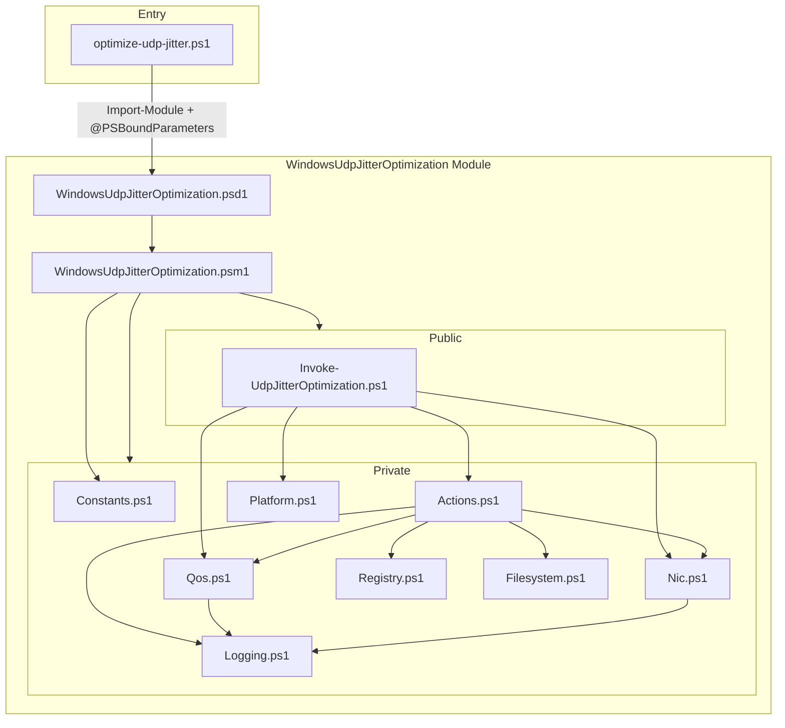
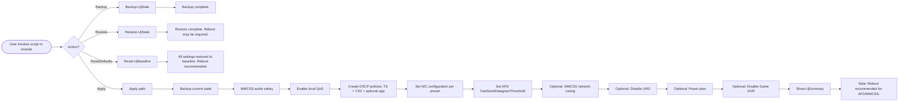
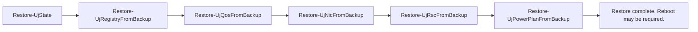

# Windows UDP Jitter Optimization — Full Documentation

Complete documentation for the PowerShell module and script that apply UDP jitter optimizations on Windows 10/11 with a full backup/restore workflow.

---

## Table of contents

- [Windows UDP Jitter Optimization — Full Documentation](#windows-udp-jitter-optimization--full-documentation)
  - [Table of contents](#table-of-contents)
  - [Overview](#overview)
  - [Architecture](#architecture)
    - [Component diagram](#component-diagram)
  - [Actions and data flow](#actions-and-data-flow)
    - [Action routing](#action-routing)
    - [Apply flow (simplified)](#apply-flow-simplified)
    - [Restore flow (internal helpers)](#restore-flow-internal-helpers)
    - [Reset flow (summary)](#reset-flow-summary)
  - [Presets](#presets)
  - [Backup and restore](#backup-and-restore)
    - [Backup folder layout](#backup-folder-layout)
    - [Managed QoS policies](#managed-qos-policies)
  - [Parameters reference](#parameters-reference)
  - [Usage examples](#usage-examples)
  - [Troubleshooting](#troubleshooting)
  - [Development and CI](#development-and-ci)
  - [Related documents](#related-documents)

---

## Overview

**Purpose:** Reduce UDP latency variance (jitter) on Windows 10/11 for real-time workloads (e.g. Counter-Strike 2, TeamSpeak) by:

- Applying **DSCP marking** (EF = 46) via Windows QoS policies for specified ports and optionally apps.
- Enabling **local QoS** so DSCP is not cleared by NLA.
- **NIC and stack tuning** (EEE, interrupt moderation, AFD, MMCSS, URO, power plan, Game DVR) in three risk tiers.

**Scope:** Client and server endpoints. The same QoS mechanisms apply; server use should follow data-center and vendor guidance and measure before/after.

**Safety:** All state-changing operations support `-WhatIf` / `-Confirm`. Apply creates a backup before changing anything. Restore and Reset only change state after user confirmation. Use `-DryRun` to preview without writes.

---

## Architecture

The project is a **PowerShell module** with a thin **entry script**. There is no build step; the module is loaded from source.

### Component diagram



**Entry script** (`optimize-udp-jitter.ps1`): Declares the same parameters as the module (including `-Action`, `-Preset`, `-DryRun`, `-SkipAdminCheck`, etc.), sets `Set-StrictMode -Version Latest` and `$ErrorActionPreference = 'Stop'`, loads the module from the repo, and calls `Invoke-UdpJitterOptimization @PSBoundParameters`.

**Module** (`WindowsUdpJitterOptimization.psm1`): Dot-sources `Constants.ps1` first, then all other Private and Public scripts. Only `Invoke-UdpJitterOptimization` is exported.

**Private scripts:**

| File | Role |
|------|------|
| `Constants.ps1` | Registry paths, backup file names, default DSCP, NIC reset property list. |
| `Actions.ps1` | Backup, Restore (and helpers), MMCSS/audio, QoS registry, AFD, MMCSS tuning, URO, power plan, Game DVR, summary, Reset. |
| `Qos.ps1` | Get/Remove managed QoS policies; create port-based and app-based DSCP policies. |
| `Nic.ps1` | Get physical up adapters; set NIC advanced properties per preset. |
| `Registry.ps1` | Export/import registry keys via reg.exe; set registry values. |
| `Platform.ps1` | Administrator check. |
| `Filesystem.ps1` | Create backup directory. |
| `Logging.ps1` | `Write-UjInformation` (wraps `Write-Information`). |

---

## Actions and data flow

### Action routing



### Apply flow (simplified)

1. **Validate:** Admin (unless `-SkipAdminCheck`), `CS2PortEnd >= CS2PortStart`, `BackupFolder` non-empty for Apply/Backup/Restore.
2. **Create backup folder** (if not `-DryRun`).
3. **Backup current state** (registry, QoS inventory, NIC advanced, RSC, power plan).
4. **Apply in order:** MMCSS audio safety → local QoS registry → QoS policies (TeamSpeak port, CS2 port range, optional app policies) → NIC configuration (preset-based) → AFD threshold → optional MMCSS network tuning (preset 3) → optional URO disable → optional power plan → optional Game DVR disable.
5. **Show summary** (QoS policies and NIC properties).

### Restore flow (internal helpers)

Restore is split into five helper functions, each with `SupportsShouldProcess` where it changes state:



- **Restore-UjRegistryFromBackup:** Imports `SystemProfile.reg` and `AFD_Parameters.reg` (each step gated by `ShouldProcess`).
- **Restore-UjQosFromBackup:** Validates `qos_ours.xml` exists and parses; only then removes managed QoS policies (with `ShouldProcess`), then recreates each policy from backup (port-based or app-based) with per-policy error handling.
- **Restore-UjNicFromBackup:** Restores NIC advanced properties from `nic_advanced_backup.csv` (by adapter, DisplayName/DisplayValue or RegistryKeyword/RegistryValue).
- **Restore-UjRscFromBackup:** Restores RSC state from `rsc_backup.csv` (Enable/Disable per adapter).
- **Restore-UjPowerPlanFromBackup:** Reads GUID from `powerplan.txt` (accepts with or without braces), then runs `powercfg /S <guid>` (with `ShouldProcess`).

All restore steps respect `-WhatIf` / `-Confirm`. If `-DryRun` is passed to Restore, no writes are performed.

### Reset flow (summary)

Reset restores a baseline: Balanced power plan, removes MMCSS/AFD/Games registry tweaks, re-enables Game DVR, resets **only** the NIC advanced properties that the module can set (from `UjNicResetDisplayNames`), re-enables RSC, removes managed QoS policies and the “Do not use NLA” registry value, runs a series of `netsh` and NetTCPSetting resets. Every state-changing step is gated by `ShouldProcess`; `netsh` exit codes are checked and warned on failure.

---

## Presets

| Preset | Name | Typical use |
|--------|------|-------------|
| **1** | Conservative (default) | MMCSS audio safety, local QoS, DSCP policies for CS2/TeamSpeak, disable EEE if supported. No AFD or aggressive NIC changes. |
| **2** | Medium | Preset 1 plus: disable interrupt moderation, flow control, green Ethernet, power saving, jumbo; set AFD `FastSendDatagramThreshold` (default 1500). Reboot recommended after apply. |
| **3** | Higher risk | Preset 2 plus: disable RSC, LSO/checksum offloads, ARP/NS/WoL; set ITR=0 and buffer sizes where exposed; optional `SystemResponsiveness=0` and `NetworkThrottlingIndex=0xFFFFFFFF`; optional URO disable via netsh. Higher CPU cost; measure before/after. |

DSCP used is **EF (46)** by default (configurable via module constants). Policies are created in Windows PersistentStore and survive reboot.

---

## Backup and restore

### Backup folder layout

Default backup folder: `$env:ProgramData\UDPTune` (overridable with `-BackupFolder`).

| File | Content |
|------|---------|
| `SystemProfile.reg` | Export of `HKLM\SOFTWARE\Microsoft\Windows NT\CurrentVersion\Multimedia\SystemProfile`. |
| `AFD_Parameters.reg` | Export of `HKLM\SYSTEM\CurrentControlSet\Services\AFD\Parameters`. |
| `qos_ours.xml` | Serialized list of managed QoS policies (name, DSCP, port/app conditions). |
| `nic_advanced_backup.csv` | Per-adapter advanced properties (Adapter, DisplayName, RegistryKeyword, DisplayValue, RegistryValue). |
| `rsc_backup.csv` | RSC state per adapter (Name, IPv4Enabled, IPv6Enabled). |
| `powerplan.txt` | Active power scheme GUID (normalized with braces for consistent restore). |

Backup runs automatically before **Apply**. For **Backup**-only or **Restore**, use the same `-BackupFolder`. With `-DryRun`, Backup and Restore perform no writes.

### Managed QoS policies

Any policy whose name starts with `QoS_` is considered **managed** by this module. Backup exports all such policies; Restore removes all managed policies and recreates them from `qos_ours.xml`. Reset removes all managed policies and the “Do not use NLA” registry value.

---

## Parameters reference

| Parameter | Type | Default | Description |
|-----------|------|---------|-------------|
| **Action** | Apply, Backup, Restore, ResetDefaults | Apply | Main operation. |
| **Preset** | 1, 2, 3 | 1 | Risk level (only used when Action = Apply). |
| **TeamSpeakPort** | 1–65535 | 9987 | Single port for TeamSpeak QoS policy. |
| **CS2PortStart** / **CS2PortEnd** | 1–65535 | 27015–27036 | CS2 port range (one QoS policy per port). |
| **IncludeAppPolicies** | switch | false | Create app-based DSCP policies. |
| **AppPaths** | string[] | @() | Executable paths for app-based policies. |
| **AfdThreshold** | 0–65535 | 1500 | AFD FastSendDatagramThreshold (preset 2+). |
| **PowerPlan** | None, HighPerformance, Ultimate | None | Switch active power plan. |
| **DisableGameDvr** | switch | false | Disable Game DVR capture. |
| **DisableUro** | switch | false | Disable URO via netsh. |
| **BackupFolder** | string | $env:ProgramData\UDPTune | Directory for backup/restore files. |
| **DryRun** | switch | false | Preview only; no system changes. |
| **SkipAdminCheck** | switch | false | Skip administrator privilege check (e.g. testing). |

The entry script supports the same parameters and passes them through to the module. Use `optimize-udp-jitter.ps1 -?` or `Get-Help Invoke-UdpJitterOptimization -Full` for inline help.

---

## Usage examples

**Apply preset 1 (safe default):**

```powershell
pwsh -NoProfile -ExecutionPolicy Bypass -File .\optimize-udp-jitter.ps1 -Action Apply -Preset 1
```

**Preview preset 2 without making changes:**

```powershell
.\optimize-udp-jitter.ps1 -Action Apply -Preset 2 -DryRun
```

**Backup to a custom folder:**

```powershell
.\optimize-udp-jitter.ps1 -Action Backup -BackupFolder C:\MyBackup
```

**Restore from that folder:**

```powershell
.\optimize-udp-jitter.ps1 -Action Restore -BackupFolder C:\MyBackup
```

**Reset to baseline (with confirmation):**

```powershell
.\optimize-udp-jitter.ps1 -Action ResetDefaults -Confirm
```

**Apply with High Performance power plan and Game DVR disabled:**

```powershell
.\optimize-udp-jitter.ps1 -Action Apply -Preset 2 -PowerPlan HighPerformance -DisableGameDvr
```

**Module usage (same parameters):**

```powershell
Import-Module .\WindowsUdpJitterOptimization\WindowsUdpJitterOptimization.psd1 -Force
Invoke-UdpJitterOptimization -Action Apply -Preset 1 -WhatIf
Invoke-UdpJitterOptimization -Action Backup -BackupFolder C:\Backup
```

---

## Troubleshooting

| Symptom | Typical cause | What to do |
|---------|----------------|------------|
| Script/module fails with “administrator” error | Not running elevated | Run PowerShell as Administrator, or use `-SkipAdminCheck` only in safe/test environments. |
| Restore reports success but registry/MMCSS unchanged | Missing .reg files or reg.exe import failed | Check backup folder for `SystemProfile.reg` and `AFD_Parameters.reg`; run with `-Verbose`; ensure backup was created on same or compatible machine. |
| QoS policies missing after restore | QoS backup missing or parse failed; or policy recreation failed | Ensure `qos_ours.xml` exists and is valid; run with `-Verbose` to see per-policy errors. |
| Apply crashes when using -DisableGameDvr | Historical: Set-ItemProperty -Type bug | Fixed: module uses `-PropertyType DWord`. Update to latest version. |
| Power plan not restored | GUID in powerplan.txt not in expected format | Backup normalizes GUID (with braces). If using an old backup, ensure powerplan.txt contains a valid GUID (with or without braces). |
| netsh / URO “succeeded” but nothing changed | Exit code not checked in older versions | Current code checks `$LASTEXITCODE` after netsh; run with `-Verbose` and check for warnings. |
| NIC tuning seems to do nothing | DisplayName mismatch (locale/driver) | Module matches NIC properties by DisplayName; different drivers/locales may not match. Check with `-Verbose`; consider reporting missing or localized names. |
| Reset changed more than expected | Historical: Reset used DisplayName '*' | Current code resets only the NIC properties listed in the module (e.g. EEE, Interrupt Moderation, Flow Control, etc.). See Constants.ps1 `UjNicResetDisplayNames`. |

For known issues and fix history, see [BUGS-AND-FIXES.md](BUGS-AND-FIXES.md) and [CHANGELOG.md](../CHANGELOG.md).

---

## Development and CI

- **Lint:** PSScriptAnalyzer (see README or `CONTRIBUTING.md` for install and command).
- **Tests:** Pester in `./tests` (offline; Windows-only cmdlets may be mocked or skipped on non-Windows).
- **CI:** GitHub Actions runs PSScriptAnalyzer and Pester on push and pull_request (see `.github/workflows/ci.yml`).
- **No build step:** Module is loaded directly from source.

See [CONTRIBUTING.md](../CONTRIBUTING.md) for prerequisites and workflow.

---

## Related documents

| Document | Description |
|----------|-------------|
| [README.md](../README.md) | Project overview, quick start, configuration summary. |
| [CHANGELOG.md](../CHANGELOG.md) | Version history and list of changes. |
| [BUGS-AND-FIXES.md](BUGS-AND-FIXES.md) | Known limitations and fix reference (audit). |
| [CONTRIBUTING.md](../CONTRIBUTING.md) | How to run tests and contribute. |
| [SECURITY.md](../SECURITY.md) | Security policy and reporting. |
| [LICENSE](../LICENSE) | MIT license. |
